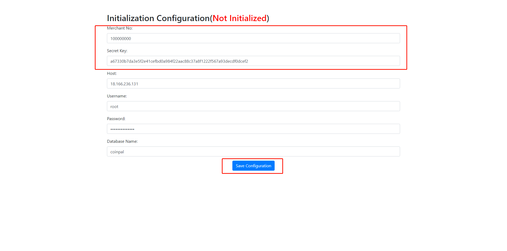
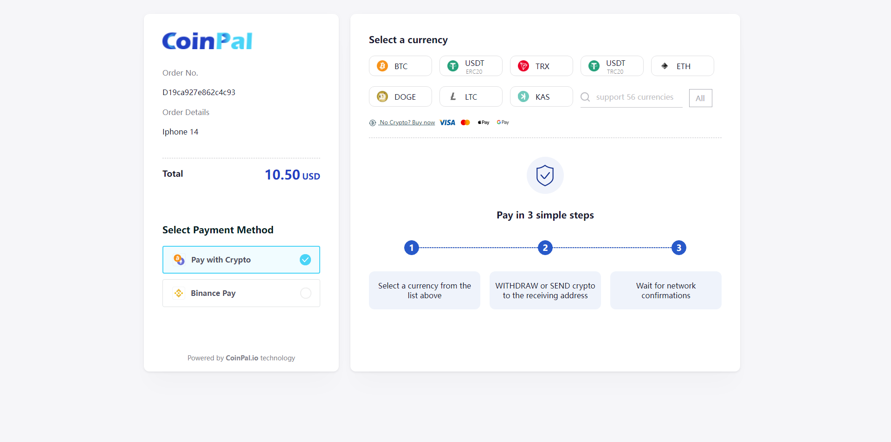
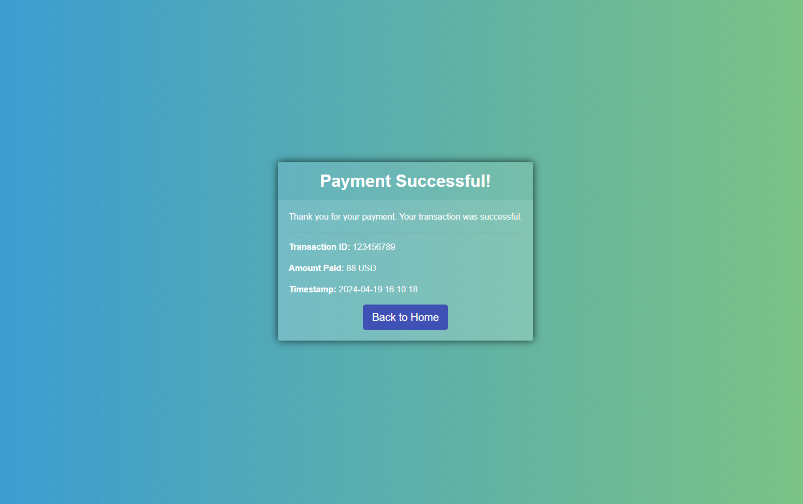

<h1 align="center"> CoinPal Payment </h1>
<p align="center"> CoinPal Payment SDK for PHP</p>
<h3 align="center"> <a target="_blank" href="https://docs.coinpal.io/">Document Address</a> </h3>

## Install

After downloading SDK_PHP, enter the SDK_PHP directory and execute the following command

```php
$ composer update
```

## Step 1: Log in to the Coinpal Admin Dashboard to get the Merchant Number and Secret Key.
1. [Register](https://portal.coinpal.io/#/admin/register)/[login](https://portal.coinpal.io/#/admin/login) and go to Coinpal's Admin Dashboard 


2. Follow the Dashboard guidelines to fill in the relevant information

3. Click the 'Integration' button in the lower left corner to get the corresponding Merchant Id and Secret Key


## Step 2: Initialization Configuration.

Initialization Configuration Page Example: [https://www.coinpal.io/sdk/config.html](https://www.coinpal.io/sdk/config.html)

Copy and Paste all of the Settings you generated in your Coinpal Dashboard on Step #1.

Click Save Configuration.

> **Tips：**
> This is just an instance, please download the code and deploy it to your server.
  


## Step 3: Test Transaction.

Transaction URL Example: [https://www.coinpal.io/sdk/transaction.php](https://www.coinpal.io/sdk/transaction.php)


After successful payment, it will jump to the page of successful payment



            
